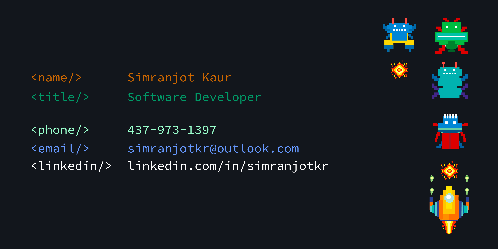

### Hey there 👋

I'm Simranjot, an enthusiastic and motivated Software Engineering post-grad student at Humber College,
looking for opportunities to learn and master the technical skills acquired in classroom. Having 4+ years of professional in developing Web-based enterprise applications using cutting-edge technologies whilst gaining working knowledge of SDLC, Agile methodologies, Service Oriented Architectures, Web services and more.

## &#x1f4c8; GitHub Stats

 

 
 

## 💼 Skills
<!--Operating Systems -->

<!--Programming Languages-->

<!--Web Technologies-->

<!--Version Control-->

<!--Database -->

<!-- Teasting Tools-->

<!-- Automation-->

<!-- Graphic Desiging-->

**Page Views**(Counting since 16th Dec 2022): 
